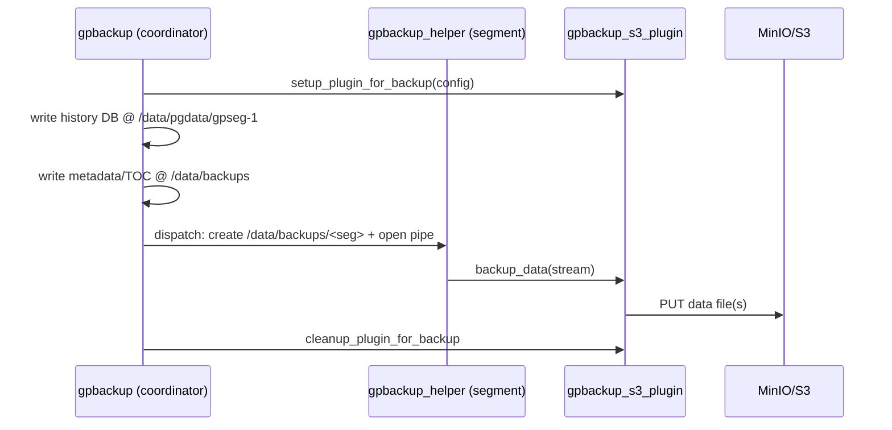

# Service & API Catalog — Backup/Restore

## REST API (operator, :8090)

| Method | Path | Description | Target-model change |
|---|---|---|---|
| GET | `/clusters/{name}/backups` | List backups (queries `gpbackman` history) | unchanged (network) |
| POST | `/clusters/{name}/backups` | Create backup; returns server-side TS | **now triggers coordinator-exec** instead of standalone Job |
| GET | `/clusters/{name}/backups/{ts}` | Backup details | unchanged |
| DELETE | `/clusters/{name}/backups/{ts}` | Delete backup (cleanup Job) | unchanged (network, `gpbackman`) |
| POST | `/clusters/{name}/backups/{ts}/restore` | Restore | **now triggers coordinator-exec** |
| GET | `/clusters/{name}/backups/jobs` | Job statuses | unchanged |
| GET | `/clusters/{name}/backups/schedule` | CronJob status | unchanged |

## Backup create (target exec command)

Request body (unchanged):
```json
{ "type": "full", "databases": ["mydb"] }
```

Operator action (target):
```bash
# rendered + exec'd INSIDE coordinator-0 (container: cloudberry)
envsubst < /etc/gpbackup/s3-plugin-config.yaml.tpl > /tmp/s3-config.yaml
gpbackup \
  --dbname mydb \
  --backup-dir /data/backups \
  --plugin-config /tmp/s3-config.yaml \
  --with-stats
```

## Restore (target exec command)

Request body (unchanged):
```json
{ "databases": ["mydb"], "gprestoreOptions": { "createDb": true } }
```

Operator action (target):
```bash
envsubst < /etc/gpbackup/s3-plugin-config.yaml.tpl > /tmp/s3-config.yaml
gprestore \
  --timestamp <TS> \
  --backup-dir /data/backups \
  --plugin-config /tmp/s3-config.yaml \
  --create-db
```

## Tool invocation contract (gpbackup storage plugin)



## Endpoints used by Scenario 71 e2e

- `POST /api/v1alpha1/clusters/<name>/backups?namespace=<ns>` → `{timestamp}`
- `POST /api/v1alpha1/clusters/<name>/backups/<ts>/restore?namespace=<ns>`

(See `test/e2e/scripts/scenario71-backup-restore.sh`.)
