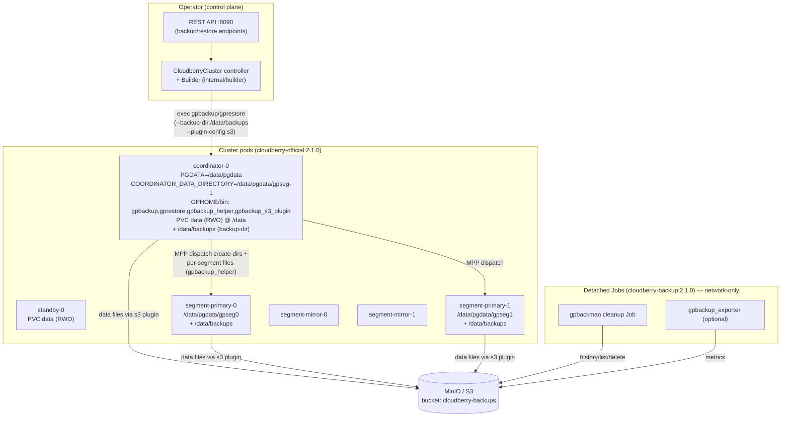
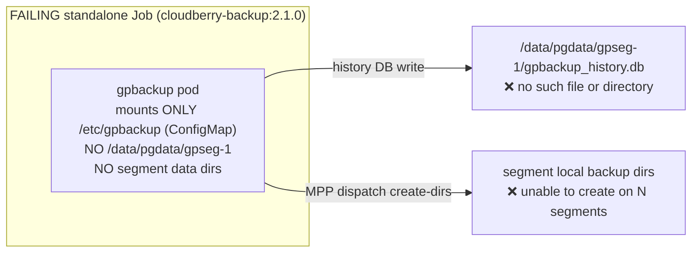
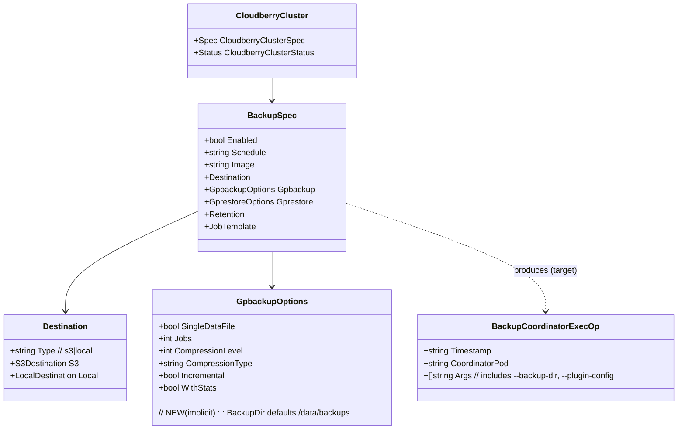
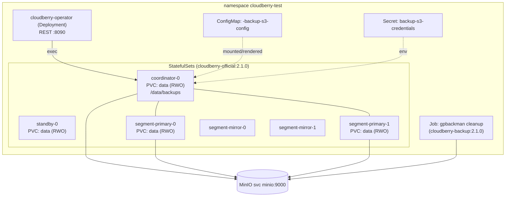

# Architecture — Cloudberry-K8s Backup/Restore (Target Design for Scenario 71)

## 1. Architecture Overview

### Architectural style

- **Kubernetes Operator** (controller + CRD `CloudberryCluster`) following a
  declarative reconcile loop.
- **Builder pattern** (`internal/builder`) constructs all Kubernetes objects
  (StatefulSets, Services, ConfigMaps, Secrets, Jobs, CronJobs) from the CR.
- **MPP database** (Apache Cloudberry) deployed as one StatefulSet per role:
  coordinator, standby, segment-primary, segment-mirror — each pod with its own
  **ReadWriteOnce** data PVC.
- Backups use the external **apache/cloudberry-backup** toolchain (`gpbackup`,
  `gprestore`, `gpbackup_helper`, `gpbackup_s3_plugin`, `gpbackman`).

### High-level component diagram (target)



### Entry points and request flow (target backup)

```mermaid
sequenceDiagram
  participant U as User/CLI
  participant API as Operator REST API :8090
  participant C as Controller/Builder
  participant K as kube-apiserver
  participant CO as coordinator-0 (cloudberry container)
  participant SEG as segment-primary-N
  participant S3 as MinIO/S3

  U->>API: POST /clusters/{n}/backups {type, databases}
  API->>C: create backup op (server-side timestamp TS)
  C->>K: render S3 ConfigMap + resolve creds Secret
  C->>CO: exec: render /tmp/s3-config.yaml; gpbackup --dbname mydb\n--backup-dir /data/backups --plugin-config /tmp/s3-config.yaml
  CO->>CO: write history DB + metadata under /data/pgdata/gpseg-1\n+ TOC under /data/backups
  CO->>SEG: MPP dispatch: create /data/backups subdir\n+ gpbackup_helper pipes
  SEG-->>S3: stream segment data files (s3 plugin)
  CO-->>S3: stream coordinator metadata/data (s3 plugin)
  CO-->>API: exit 0 (TS, size, duration)
  API-->>U: 202 {timestamp: TS}
```

## 2. Why the previous (failing) flow broke



Root cause: coordinator data dir + per-segment dirs live on **per-pod RWO PVCs**
that a separate Job pod cannot mount; the S3 plugin only moves data files, not
the history/metadata/per-segment dirs. (Full detail in
`architecture-findings.md`.)

## 3. Module / Package Map

| Package / file | Responsibility |
|---|---|
| `api/v1alpha1` | CRD types: `CloudberryCluster`, `BackupSpec`, `GpbackupOptions`, `GprestoreOptions`, S3 destination. |
| `internal/builder/builder.go` | Builds cluster StatefulSets/Services/ConfigMaps; defines data-dir layout (`PGDATA=/data/pgdata`, per-pod RWO PVC `data`). |
| `internal/builder/backup_builder.go` | Builds backup/restore/cleanup/validation Jobs, S3 ConfigMap, arg builders. **Target of the fix.** |
| `hack/docker-entrypoint-cloudberry.sh` | Cluster pod init: coordinator/segment data dirs, segment registration. **Add `/data/backups` here.** |
| `Dockerfile.cloudberry-official` | Cluster image; bundles gpbackup toolchain in `GPHOME/bin`. |
| `Dockerfile.cloudberry-backup` | Standalone toolchain image; keep for cleanup/exporter. |
| `internal/api` | REST API endpoints driving backup/restore. |

## 4. Domain Model (relevant slice)



## 5. Deployment Topology (target)



Key invariants:
- Each role pod owns its `data` RWO PVC (`builder.go:1170-1184`).
- `/data/backups` exists on **every** role pod (entrypoint change) so MPP
  create-dirs + `gpbackup_helper` pipes succeed locally.
- Bulk data goes to MinIO via the S3 plugin; only small metadata/TOC/history
  stay on PVCs.

See `dependency-map.md`, `api.md`, `data.md`, `security.md`, `requirement.md`.
