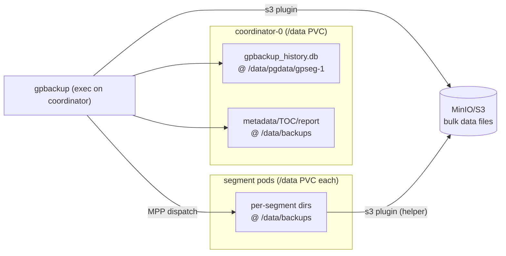
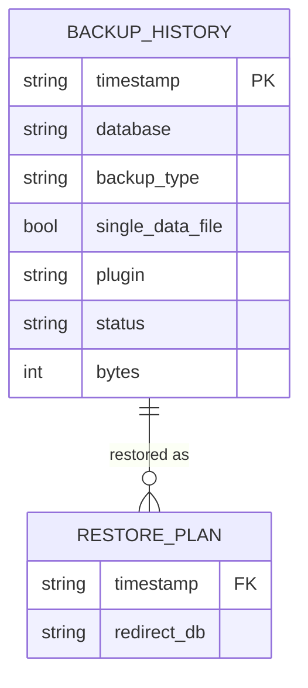
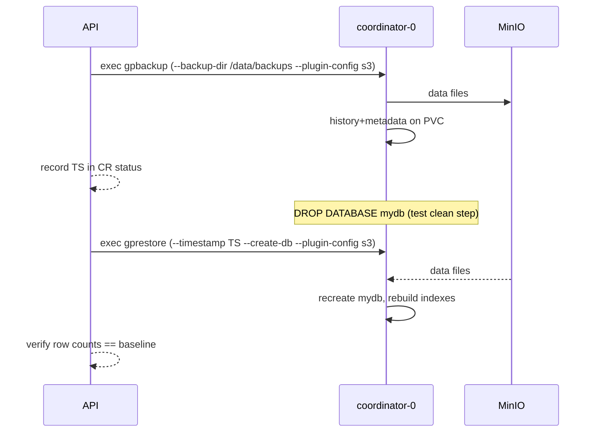

# Data Architecture — Backup Artifacts & Flows

## 1. Where each artifact lives (target)

| Artifact | Location | Lives on | Notes |
|---|---|---|---|
| History DB `gpbackup_history.db` | `/data/pgdata/gpseg-1/` | coordinator RWO PVC | Default = `$COORDINATOR_DATA_DIRECTORY`. Reachable only in coordinator-exec model. |
| Backup metadata / TOC / report | `/data/backups/backups/<date>/<TS>/` | coordinator RWO PVC | Controlled by `--backup-dir /data/backups`. Small. |
| Per-segment working dirs / pipes | `/data/backups/...` on each segment | each segment RWO PVC | Created by MPP dispatch + `gpbackup_helper`. Was failing without exec model + backup-dir. |
| Bulk data files (compressed CSV) | MinIO `s3://cloudberry-backups/backups/...` | object store | Streamed by `gpbackup_s3_plugin`; NOT persisted on PVCs. |

## 2. Data flow diagram

## 3. ER-ish view of history DB (gpbackup-managed)

(Schema is owned by gpbackup; shown for orientation only.)

## 4. Event flow (backup → restore cycle, Scenario 71)

## 5. Capacity / retention notes

- PVC growth from backups is bounded to **metadata/TOC/history** only (KB–MB),
  because data files go to S3. `/data/backups` should be pruned after each run
  (gpbackup cleans its working dirs; the operator may also clear stale TOC).
- Retention of the actual backup *sets* is enforced by the `gpbackman` cleanup
  Job against S3 + history (network-only; unaffected by this fix).
