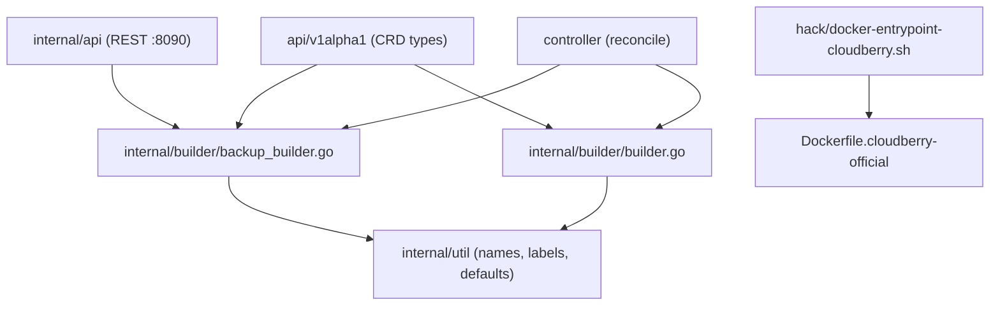

# Dependency Map — Backup/Restore Subsystem

## Internal dependencies

| From | To | Nature | Notes / problem |
|---|---|---|---|
| `backup_builder.go` | `cloudberry-backup:2.1.0` image | runtime image for Job pods | **Problematic for live data path**: standalone pod cannot reach coordinator/segment data dirs. Keep only for cleanup/exporter. |
| `backup_builder.go` | coordinator pod / data dir | *implicit* (history DB path `/data/pgdata/gpseg-1`) | Today **unsatisfied** in the Job pod → fix via coordinator-exec model. |
| `backup_builder.go` | `<cluster>-backup-s3-config` ConfigMap | mount `/etc/gpbackup` | Reusable in exec model (mount/render into coordinator). |
| `backup_builder.go` | `backup-s3-credentials` Secret | env `AWS_*` | Reusable; inject into exec session. |
| `builder.go` | per-pod `data` RWO PVC | volume `/data` | Cluster topology; basis for `/data/backups` backup-dir. |
| entrypoint | `gp_segment_configuration` | registers segment datadirs `/data/pgdata/gpsegN` | Determines where gpbackup dispatches per-segment dirs. |

## External dependencies / tooling

| Tool | Image with it | Used by | Talks to |
|---|---|---|---|
| `gpbackup` | official (`GPHOME/bin`) **and** backup image | coordinator-exec (target) | coordinator + segments (MPP), S3 plugin |
| `gprestore` | both images | coordinator-exec (target) | coordinator + segments, S3 plugin |
| `gpbackup_helper` | both images | segment backends during `--single-data-file` | named pipes under `--backup-dir` |
| `gpbackup_s3_plugin` | both images | gpbackup/gprestore | MinIO/S3 |
| `gpbackman` | backup image | retention cleanup Job (network-only) | S3 + history DB |
| `gpbackup_exporter` | backup image | metrics (optional) | history DB |
| `psql`/libpq | both images | pre-checks, validation | coordinator |

## Problematic dependencies (flagged)

1. **Live backup → standalone Job image** (critical): incompatible with MPP exec
   semantics in per-pod-RWO topology. Re-route to coordinator-exec.
2. **History-DB path hard-bound to coordinator data dir** (critical): satisfied
   only when running on the coordinator. The exec model resolves it.
3. **No `--backup-dir`** (high): per-segment dirs default into PGDATA. Add
   `/data/backups`.

## Service & API catalog

See `api.md` for the full endpoint catalog and the target exec-model request
flow.
