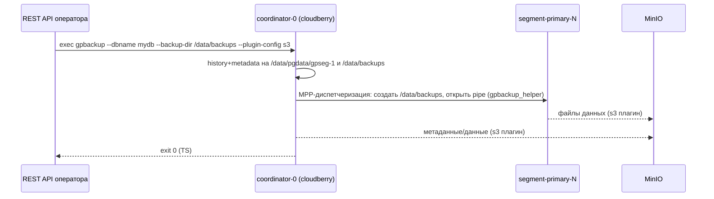

# Документ solution-архитектуры: исправление выполнения резервного копирования (Сценарий 71)

> Примечание: файл `solution/template.md` в репозитории отсутствует, поэтому
> документ оформлен по стандартной структуре solution-архитектуры.

## 1. Общие сведения

| Поле | Значение |
|---|---|
| Название | Рабочий цикл gpbackup → S3(MinIO) → gprestore в контейнеризованной топологии Cloudberry |
| Компонент | Оператор `cloudberry-k8s`, подсистема backup/restore |
| Статус | Проект решения (только анализ; код не изменяется) |
| Связанный сценарий | Scenario 71 — Enable Backup with Full S3 Configuration |
| Спецификация | `specifications/11-backup-restore-spec.md` |

## 2. Бизнес-контекст и проблема

Оператор создаёт отдельный Kubernetes Job (образ `cloudberry-backup:2.1.0`),
который запускает `gpbackup` с S3-плагином для резервного копирования базы
`mydb` в MinIO. Несмотря на использование S3-плагина, операция падает:

```
[CRITICAL]: Unable to create backup directories on 3 segments.
[ERROR]: Unable to update history database. Error:
         open /data/pgdata/gpseg-1/gpbackup_history.db: no such file or directory
```

Цель — обеспечить реальный рабочий цикл резервного копирования и восстановления
минимальными изменениями.

## 3. Корневая причина

`gpbackup` — это MPP-инструмент, работающий через **координатор**. Даже с
S3-плагином (который передаёт только файлы данных) `gpbackup`:

1. пишет **history DB** и **метаданные** в каталог данных координатора
   (`$COORDINATOR_DATA_DIRECTORY = /data/pgdata/gpseg-1`);
2. через MPP-диспетчеризацию заставляет **каждый сегмент** создать локальный
   каталог резервного копирования и записать туда пер-сегментные файлы (через
   `gpbackup_helper`).

Резервное копирование запускается в **изолированном Job-pod**, который не
монтирует каталог данных координатора и не имеет доступа к каталогам данных
сегментов. Каждый pod кластера использует **собственный RWO PVC**
(`internal/builder/builder.go:1170-1184`), поэтому отдельный Job-pod физически не
может смонтировать эти каталоги.

**Вывод:** проблема архитектурная (несовместимость модели «отдельный Job» с
семантикой MPP gpbackup), а не отсутствие флага.

Подтверждение по коду:
- Путь координатора: `Dockerfile.cloudberry-official:140,152`,
  `hack/docker-entrypoint-cloudberry.sh:33`.
- Каталоги сегментов: `hack/docker-entrypoint-cloudberry.sh:508,515`.
- Job монтирует только ConfigMap S3: `internal/builder/backup_builder.go:906-969`.
- Все бинарники (`gpbackup`, `gprestore`, `gpbackup_helper`,
  `gpbackup_s3_plugin`) уже есть в официальном образе кластера в `GPHOME/bin`:
  `Dockerfile.cloudberry-official:95-103`.

## 4. Целевое решение (минимально достаточное)

Запускать `gpbackup`/`gprestore` **внутри контейнера координатора** (модель
exec), а не в отдельном pod. Дополнительно:

- добавить флаг **`--backup-dir /data/backups`** для backup и restore;
- создавать каталог `/data/backups` (0700, gpadmin) на **всех** ролях
  (координатор, standby, primary, mirror) в entrypoint;
- рендерить конфиг S3-плагина и прокидывать `AWS_*` в exec-сессию координатора
  (переиспользуя текущие ConfigMap/Secret).

Объёмные файлы данных по-прежнему стримятся в MinIO через S3-плагин; на PVC
остаются только небольшие метаданные/TOC/history.

### Диаграмма целевого потока



## 5. Рассмотренные альтернативы

| Вариант | Решение | Причина |
|---|---|---|
| (a) `--backup-dir` только в Job-pod | Отклонён | Каталог должен быть на координаторе и каждом сегменте, а не в Job-pod. |
| (b) `--single-data-file` + `gpbackup_helper` | Частично нужен | Helper уже в образе, но работает только при диспетчеризации из живого кластера; standalone Job это не спасает. |
| (c) Общий RWX PVC на всех pod | Отклонён | Тяжёлое и рискованное изменение всех StatefulSet; требует RWX-хранилища. |
| (d) Exec внутри pod координатора | **Выбран** | Минимальные изменения; нет RWX и пересборки образа; gpbackup использует штатный MPP-путь. |

## 6. Объём изменений

| Слой | Изменение | Требуется? |
|---|---|---|
| Go (`backup_builder.go`) | `--backup-dir /data/backups`; перевод backup/restore на exec в координатор | Да |
| Entrypoint (`docker-entrypoint-cloudberry.sh`) | `mkdir -p /data/backups` (0700) для всех ролей | Да (скрипт, не бинарь) |
| Образ кластера | Новые бинарники | Нет (уже есть) |
| RWX PVC / общий том | — | Нет |
| RBAC | `pods/exec` для SA оператора | Да |
| Spec 11 | Описать exec-модель и `--backup-dir` | Да |

## 7. Безопасность

- Учётные данные S3 — из Secret, инъекция через env; никогда не на диск и не в
  ConfigMap. Конфиг плагина рендерится через `envsubst` в эфемерный
  `/tmp/s3-config.yaml`.
- Новый RBAC-грант: `pods/exec` на pod координатора для SA оператора.
- Трафик в S3 — TLS (`encryption: on`), SigV4 для MinIO.

## 8. Критерии приёмки

`test/e2e/scripts/scenario71-backup-restore.sh` проходит для вариантов `secret` и
`vault`: backup завершается, объекты появляются в бакете MinIO, restore
завершается, число строк `dim`/`events` совпадает с базовым замером.

## 9. Передача в реализацию

См. `architecture-findings.md` §6 — конкретные правки для агента
`go-development`.
