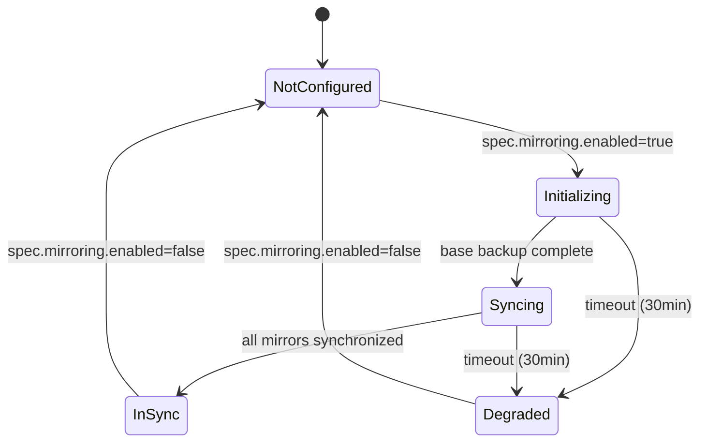
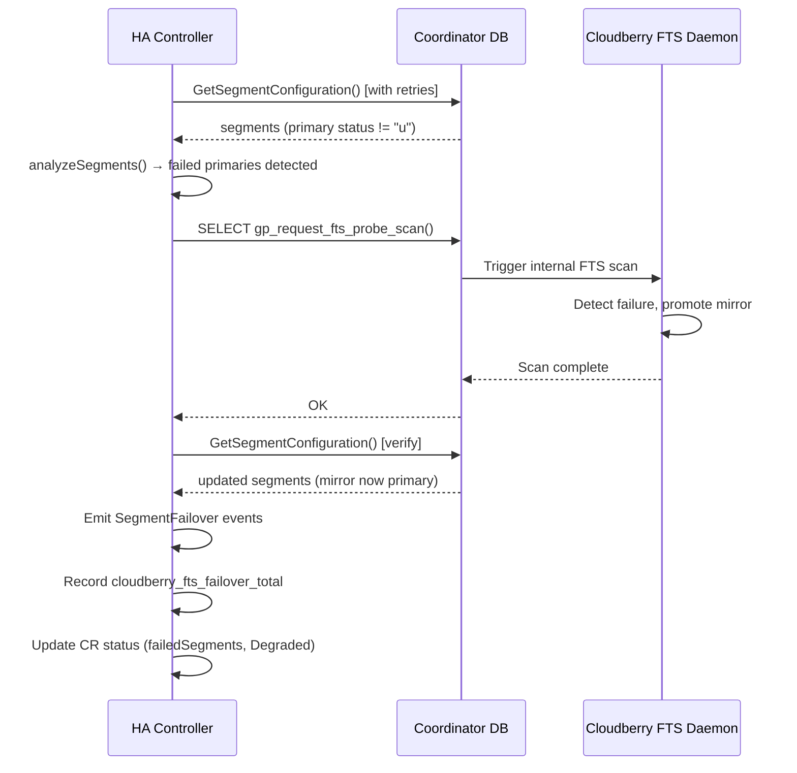

# Cloudberry Operator - High Availability & Recovery Specification

**Version**: 1.0.0

---

## 1. Overview

This specification covers the operator's high availability and recovery capabilities, including segment mirroring, fault detection, automatic failover, coordinator standby management, and recovery operations.

## 2. Segment Mirroring

### 2.1 Mirroring Configuration

**Source**: `spec.segments.mirroring`

```yaml
segments:
  count: 8
  primariesPerHost: 2
  mirroring:
    enabled: true
    layout: group  # group | spread
```

### 2.2 Group Mirroring Layout

All mirrors for one host's primary segments are placed on one other host.

**Operator Implementation**:
- StatefulSet for primaries: `{cluster}-segment-primary`
- StatefulSet for mirrors: `{cluster}-segment-mirror`
- Pod anti-affinity ensures primary and mirror never share a node
- Mirror placement follows group algorithm:
  - Host N's mirrors go to Host (N+1) % total_hosts

### 2.3 Spread Mirroring Layout

Each host's mirrors are distributed across multiple remaining hosts.

**Operator Implementation**:
- Requires: number of hosts > primariesPerHost
- Mirror placement follows spread algorithm:
  - Host N's mirror M goes to Host (N + M + 1) % total_hosts
- Pod topology spread constraints enforce distribution

### 2.4 Adding Mirrors to Existing Cluster (Enable Mirroring)

**Trigger**: Change `spec.segments.mirroring.enabled` from `false` to `true` on a Running cluster.

**Pre-flight Validation**:
- Cluster must be in `Running` phase (rejected otherwise)
- Segment count must be sufficient for the chosen layout:
  - **Group layout**: requires `count >= 2 * primariesPerHost`
  - **Spread layout**: requires `count > primariesPerHost`
- Validated at both webhook admission and controller level

**State Machine**:



**Phase Transitions** (tracked via `avsoft.io/mirroring-state` annotation):

| Phase | Description | Next Phase |
|-------|-------------|------------|
| `creating-sts` | Mirror StatefulSet created, waiting for pods to be ready | `initializing` |
| `initializing` | Base backup from primaries via `InitializeMirrors()`, WAL replication configured via `ConfigureReplication()` | `syncing` |
| `syncing` | Monitoring mirror sync status via `GetMirrorSyncStatus()` | `completed` |
| `completed` | All mirrors synchronized, operation finalized | — |

**Detailed Process**:

1. **Transition to Updating phase**: Set `status.phase: Updating`, `status.mirroringStatus: Initializing`, and `MirroringHealthy` condition to `False` with reason `MirroringInitializing`.
2. **Save state annotation**: Write `avsoft.io/mirroring-state` JSON annotation with phase, timestamps, and layout.
3. **Create mirror StatefulSet**: Build and apply `{cluster}-segment-mirror` StatefulSet via resource builder.
4. **Emit event**: `MirroringEnabled` — "Mirroring enable initiated with {layout} layout".
5. **Wait for STS readiness** (requeue loop): Poll until all mirror pods are ready.
6. **Initialize mirrors**: Call `DBClient.InitializeMirrors()` with layout, segment count, and parallelism (default: 2). Then call `DBClient.ConfigureReplication()` with sync mode.
7. **Monitor sync**: Call `DBClient.GetMirrorSyncStatus()` to check per-segment sync status. Update `SetReplicationLag` metric per segment. Set `status.mirroringStatus: Syncing` during this phase.
8. **Complete**: Set `status.phase: Running`, `status.mirroringStatus: InSync`, `MirroringHealthy` condition to `True`. Remove `avsoft.io/mirroring-state` annotation. Emit `MirroringInSync` event. Record `cloudberry_mirroring_operations_total{operation="enable"}` metric.

**Cluster Phase Transition**: `Running` → `Updating` → `Running`

**Timeout Handling**:
- **Timeout**: 30 minutes from operation start
- **On timeout**: Set `status.mirroringStatus: Degraded`, set `MirroringHealthy` condition to `False` with reason `MirroringTimeout`, remove state annotation, emit `MirroringFailed` event with timeout message.
- The cluster remains in a usable state; the partially initialized mirrors may require manual intervention.

**Error Handling**:
- If the cluster is not in `Running` phase, the operation is silently skipped with a warning event (`MirroringFailed`).
- If node count validation fails, the operation is skipped with a warning event.
- Transient errors during STS creation, DB initialization, or sync monitoring trigger requeue with backoff.
- If no `dbFactory` is configured, DB-level initialization is skipped (mirrors initialize via in-pod utilities).

### 2.5 Removing Mirrors from Existing Cluster (Disable Mirroring)

**Trigger**: Change `spec.segments.mirroring.enabled` from `true` to `false` on a Running cluster.

**Pre-flight Validation**:
- Cluster must be in `Running` phase (rejected otherwise)
- Disabling is allowed from any mirroring status (`InSync`, `Degraded`, `Syncing`, etc.)

**Process**:

1. **Emit warning event**: `MirroringDisabled` — "Mirroring disable initiated — data protection will be reduced".
2. **Delete mirror StatefulSet**: Delete `{cluster}-segment-mirror` StatefulSet. Ignore `NotFound` errors (idempotent).
3. **Clean up PVCs** (conditional):
   - If `spec.deletionPolicy: Delete` — delete all mirror PVCs (`data-{cluster}-segment-mirror-{i}` for each segment).
   - If `spec.deletionPolicy: Retain` — retain PVCs for potential re-enable.
4. **Update status**: Set `status.mirroringStatus: NotConfigured`, set `MirroringHealthy` condition to `False` with reason `MirroringDisabled`.
5. **Emit event**: `MirroringDisabled` — "Mirroring disabled successfully".
6. **Record metric**: `cloudberry_mirroring_operations_total{operation="disable"}`.

**Note**: Disabling mirroring does not change the cluster phase — it remains `Running` throughout.

### 2.6 Replication Lag Monitoring in FTS Probe

The FTS probe loop (see Section 3) includes replication lag monitoring for mirror segments:

1. During each FTS probe cycle, the HA controller calls `DBClient.GetMirrorSyncStatus()`.
2. For each mirror segment, the replication lag is reported via `SetReplicationLag(cluster, namespace, segmentID, lagBytes)`.
3. This updates the `cloudberry_replication_lag_bytes` Prometheus gauge per segment.
4. The same monitoring is performed during the mirroring enable `syncing` phase by the cluster controller.

### 2.7 Webhook Validation for Mirroring Transitions

The validating webhook (`validateMirroringTransition`) enforces the following rules on UPDATE operations:

| Transition | Validation | Result |
|-----------|------------|--------|
| Enable mirroring (`false` → `true`) | Cluster must be in `Running` phase | Reject if not Running |
| Enable mirroring (`false` → `true`) | Segment count must satisfy layout requirements | Reject with count details |
| Enable spread mirroring | Marginal segment count (`count <= primariesPerHost + 1`) | Admit with warning |
| Disable mirroring (`true` → `false`) | No restrictions beyond Running phase | Always allowed |
| Change layout while enabled | Layout change (`group` ↔ `spread`) | Reject — must disable first |
| No mirroring change | Layout change while both disabled | Allowed |

**Validation Functions**:
- `validateMirroringTransition(old, new)` — entry point, dispatches to sub-validators
- `validateMirroringEnable(old, new)` — checks Running phase and node count
- `validateMirroringLayoutChange(old, new, bothEnabled)` — rejects layout changes while enabled
- `validateNodeCountForMirroring(layout, count, primariesPerHost)` — arithmetic validation

### 2.8 Transaction Log Replication

- Continuous WAL streaming from primary to mirror
- Synchronous or asynchronous mode (configurable via `ReplicationOptions.Mode`)
- Replication lag monitoring via `cloudberry_replication_lag_bytes` Prometheus metric
- Lag reported per segment during FTS probe cycle and mirroring sync monitoring

## 3. Fault Tolerance Service (FTS)

### 3.1 Configuration

**Source**: `spec.ha`

```yaml
ha:
  ftsProbeInterval: 60    # seconds between probes
  ftsProbeTimeout: 20     # seconds to wait for response
  ftsProbeRetries: 5      # retries before marking down
  checksums: true          # storage-layer checksums
```

### 3.2 Probe Mechanism

The operator implements FTS probing via `runFTSProbe()` in the HA controller:

1. **Probe Loop**: Every `ftsProbeInterval` seconds (default: 60s), the HA controller runs a probe cycle for clusters with mirroring enabled.
2. **Segment Configuration Read**: The probe calls `GetSegmentConfiguration()` to read `gp_segment_configuration` from the coordinator, wrapped in a retry loop (`probeSegmentConfigWithRetries`).
3. **Retry Logic**: Each probe attempt uses a dedicated context with `ftsProbeTimeout` deadline (default: 20s). If the attempt fails, the `fts_probe_failures_total` metric is incremented and the next attempt begins. Up to `ftsProbeRetries` attempts (default: 5) are made before the probe is considered failed.
4. **Segment Analysis**: On successful read, `analyzeSegments()` evaluates each segment's health. Segments with `status != "u"` are marked as failed. Per-segment status is reported via `cloudberry_segment_status` (1=up, 0=down).
5. **Failover Trigger**: If any primary segments (role="p") are failed and mirroring is enabled, `handleFailover()` is called (see Section 3.3).
6. **Status Update**: `updateFTSProbeStatus()` updates the cluster's `mirroringStatus` (`InSync` or `Degraded`), `failedSegments` list, and related metrics (`cloudberry_segments_failed`, `cloudberry_mirroring_in_sync`).
7. **Replication Lag**: Mirror replication lag is reported per segment via `GetMirrorSyncStatus()` and the `cloudberry_replication_lag_bytes` metric.

**Retry Flow**:

```
for attempt = 1 to ftsProbeRetries:
    ctx = context.WithTimeout(parentCtx, ftsProbeTimeout)
    segments, err = GetSegmentConfiguration(ctx)
    if err == nil:
        return segments
    fts_probe_failures_total++
    log warning with attempt number
return error("after N retries: last error")
```

### 3.3 Automatic Failover

**Trigger**: FTS probe detects one or more primary segments with `status != "u"` while mirroring is enabled.

**Process** (`handleFailover()`):

1. **Identify failed primaries**: `analyzeSegments()` identifies segments where `role="p"` and `status != "u"`.
2. **Trigger Cloudberry internal FTS**: Call `TriggerFTSProbe()` which executes `SELECT gp_request_fts_probe_scan()` on the coordinator. This triggers Cloudberry's built-in FTS daemon to detect the failure and promote the mirror to primary role. If this call fails, the failover continues with status reporting (best-effort).
3. **Verify failover result**: Re-read segment configuration via `GetSegmentConfiguration()` to check whether mirrors were promoted. The controller builds a lookup map by `(contentID, role)` to verify each failed primary.
4. **Emit events per failed segment**: For each failed primary:
   - If a different DBID now holds the primary role for that contentID → emit `SegmentFailover` event: "Segment failover completed: contentID=N, original primary=X, new primary=Y"
   - If the mirror was not promoted → emit `SegmentFailover` event: "Primary segment failed: contentID=N, hostname=X, mirror promotion pending"
5. **Update per-segment metrics**: Set `cloudberry_segment_status` to 0 (down) for each failed primary.
6. **Record failover metric**: Increment `cloudberry_fts_failover_total` once per failover event (not per segment).
7. **Update CR status**: Set `failedSegments` list and `mirroringStatus: Degraded`.

**Failover Flow Diagram**:



**Error Handling**:
- If `TriggerFTSProbe()` fails, the controller logs the error but continues to emit events and update metrics for the originally detected failures.
- If the post-failover `GetSegmentConfiguration()` fails, events are emitted for the originally detected failures and `RecordFTSFailover` is still called.
- If no `dbFactory` is configured, the FTS probe is skipped entirely with a failure metric recorded.

### 3.4 Prometheus Metrics for FTS

| Metric | Type | Labels | Description |
|--------|------|--------|-------------|
| `cloudberry_fts_probe_total` | Counter | cluster, namespace | Total FTS probes (recorded with result label: "success", "degraded", or "failure") |
| `cloudberry_fts_probe_failures_total` | Counter | cluster, namespace | Failed FTS probe attempts. Incremented per retry failure in `probeSegmentConfigWithRetries` — a single probe cycle with 3 failed attempts before success increments this counter by 3. |
| `cloudberry_fts_probe_duration_seconds` | Histogram | cluster, namespace | Probe duration |
| `cloudberry_fts_failover_total` | Counter | cluster, namespace | Total failover events. Incremented once per `handleFailover()` invocation (not per failed segment). Triggered when failed primaries are detected and mirroring is enabled. |
| `cloudberry_segment_status` | Gauge | cluster, namespace, segment | Per-segment status (1=up, 0=down). Updated by `analyzeSegments()` for all segments and set to 0 for failed primaries during `handleFailover()`. |
| `cloudberry_segments_failed` | Gauge | cluster, namespace | Count of currently failed segments. Set by `updateFTSProbeStatus()` when segments are unhealthy. |
| `cloudberry_replication_lag_bytes` | Gauge | cluster, namespace, segment | Replication lag per segment (updated by FTS probe and mirroring sync monitor) |
| `cloudberry_mirroring_operations_total` | Counter | cluster, namespace, operation | Mirroring enable/disable operations (operation: "enable" or "disable") |

## 4. Segment Recovery

### 4.1 Incremental Recovery

**Trigger**: `cloudberry-ctl recovery incremental --cluster my-cluster`

Or CR annotation: `avsoft.io/recovery: incremental`

**Process**:
1. Identify failed segments from CR status
2. For each failed segment:
   a. Connect to the live mirror
   b. Copy only WAL changes missed during downtime
   c. Start the recovered segment
   d. Verify replication sync
3. Update CR status

**Use Case**: Segment was down briefly, data is intact.

### 4.2 Full Recovery

**Trigger**: `cloudberry-ctl recovery full --cluster my-cluster`

Or CR annotation: `avsoft.io/recovery: full`

**Process**:
1. Identify failed segments
2. For each failed segment:
   a. Delete existing data on failed segment PVC
   b. Copy all data from live mirror (pg_basebackup equivalent)
   c. Start the recovered segment
   d. Verify replication sync
3. Update CR status

**Use Case**: Segment data is corrupted.

### 4.3 Differential Recovery

**Trigger**: `cloudberry-ctl recovery differential --cluster my-cluster`

**Process**:
1. Identify failed segments
2. For each failed segment:
   a. Sync only file-level differences (rsync equivalent)
   b. Support parallel copy streams
   c. Start the recovered segment
   d. Verify replication sync
3. Update CR status

**Use Case**: Large segments where minimizing data transfer is important.

### 4.4 Recovery to Different Host

**Trigger**: `cloudberry-ctl recovery --cluster my-cluster --target-node node-3`

**Process**:
1. Validate target node has sufficient resources
2. Create new PVC on target node
3. Copy data from live mirror to new PVC
4. Update segment configuration
5. Start recovered segment on new node
6. Verify replication sync

### 4.5 Rebalancing After Recovery

**Trigger**: `cloudberry-ctl rebalance --cluster my-cluster`

Or CR annotation: `avsoft.io/action: rebalance`

**Process**:
1. Identify segments where mirror is acting as primary
2. For each such segment:
   a. Ensure original primary is recovered and synced
   b. Demote current primary (was mirror) back to mirror role
   c. Promote original primary back to primary role
3. Verify all segments are in preferred roles
4. Update CR status

**Selective Rebalance**:
```bash
cloudberry-ctl rebalance --cluster my-cluster --content-ids 0,1,2
```

## 5. Coordinator Standby

### 5.1 Deploy Standby

**Trigger**: Set `spec.standby.enabled: true`

**Process**:
1. Create standby StatefulSet `{cluster}-coordinator-standby`
2. Create standby PVC
3. Initialize standby from coordinator (pg_basebackup)
4. Configure WAL streaming replication
5. Verify standby is receiving WAL
6. Update status: `standbyReady: true`

### 5.2 WAL Replication to Standby

- Continuous WAL streaming from coordinator to standby
- Standby replays WAL to maintain current state
- Replication lag monitored via:
  - `cloudberry_standby_replication_lag_bytes` (Prometheus)
  - `status.conditions[StandbyReady]` (CR status)

### 5.3 Activate Standby on Coordinator Failure

**Trigger**: `cloudberry-ctl standby activate --cluster my-cluster`

Or CR annotation: `avsoft.io/action: activate-standby`

**Note**: Activation is NOT automatic - requires explicit administrator action.

**Process**:
1. Verify coordinator is truly unavailable
2. Promote standby to primary coordinator
3. Update Services to point to new coordinator
4. Reconstruct state from replicated WAL
5. Update CR status: `coordinatorReady: true` (pointing to former standby)
6. Emit event: `CoordinatorFailover`

### 5.4 Reinitialize Standby After Failover

**Trigger**: `cloudberry-ctl standby reinitialize --cluster my-cluster`

**Process**:
1. Repair or replace original coordinator node
2. Initialize new standby on original host
3. Configure WAL streaming from new coordinator
4. Verify standby sync
5. Update status

### 5.5 Restore Original Roles

**Trigger**: `cloudberry-ctl standby restore-roles --cluster my-cluster`

**Process**:
1. Stop cluster
2. Swap coordinator and standby roles
3. Reinitialize standby on secondary host
4. Start cluster
5. Verify health

## 6. Coordinator Mirroring Status

### 6.1 Status Reporting

The operator reports coordinator mirroring status in:

- CR status condition: `StandbyReady`
- Prometheus metric: `cloudberry_standby_up`
- Prometheus metric: `cloudberry_standby_replication_lag_bytes`
- Kubernetes events on state changes

### 6.2 Health Checks

| Check | Frequency | Action on Failure |
|-------|-----------|-------------------|
| Standby pod health | Every 10s (K8s probe) | Restart pod |
| WAL replication active | Every `ftsProbeInterval` | Alert, update status |
| Replication lag | Every `ftsProbeInterval` | Alert if exceeds threshold |

## 7. Storage-Layer Checksums

**Source**: `spec.ha.checksums`

When enabled:
- Block-level checksums for heap and append-optimized storage
- Detects data corruption on disk
- Configured at cluster initialization time
- Cannot be changed after initialization

## 8. Network Redundancy

### 8.1 Interconnect Configuration

Managed via `spec.config.parameters`:

```yaml
config:
  parameters:
    gp_interconnect_type: "udpifc"  # or "tcp"
    gp_max_packet_size: "8192"
```

### 8.2 Pod Network Policies

The operator creates NetworkPolicies to:
- Allow coordinator <-> segment communication
- Allow segment <-> segment communication (interconnect)
- Allow coordinator <-> standby replication
- Allow primary <-> mirror replication
- Allow external client access to coordinator only

## 9. Recovery Kubernetes Jobs

Recovery operations are implemented as Kubernetes Jobs:

```yaml
apiVersion: batch/v1
kind: Job
metadata:
  name: {cluster}-recovery-{timestamp}
  namespace: {namespace}
  labels:
    app.kubernetes.io/managed-by: cloudberry-operator
    avsoft.io/cluster: {cluster}
    avsoft.io/operation: recovery
spec:
  backoffLimit: 3
  activeDeadlineSeconds: 3600
  template:
    spec:
      containers:
        - name: recovery
          image: {cluster-image}
          command: ["/recovery-entrypoint.sh"]
          env:
            - name: RECOVERY_TYPE
              value: "incremental"  # or full, differential
            - name: TARGET_SEGMENTS
              value: "0,1"
      restartPolicy: Never
```

## 10. Event Types

| Event | Type | Reason | Description |
|-------|------|--------|-------------|
| SegmentFailover | Warning | SegmentFailover | Primary segment failed, mirror promotion triggered via `gp_request_fts_probe_scan()`. Emitted per failed primary with details: contentID, original hostname, and new primary hostname (if promotion verified) or "mirror promotion pending" (if not yet confirmed). |
| SegmentFailoverCompleted | Normal | SegmentFailoverCompleted | Segment failover has completed and been verified |
| SegmentRecovered | Normal | SegmentRecovered | Failed segment recovered |
| SegmentsRebalanced | Normal | Rebalanced | Segment roles restored to preferred |
| CoordinatorFailover | Warning | CoordinatorDown | Coordinator failed, standby activated |
| StandbyInitialized | Normal | StandbyReady | Standby coordinator initialized |
| MirroringEnabled | Normal | MirroringEnabled | Mirroring enable initiated with layout |
| MirroringDisabled | Warning/Normal | MirroringDisabled | Mirroring disable initiated / completed |
| MirroringInitializing | Normal | MirroringInitializing | Mirror StatefulSet created, initialization in progress |
| MirroringInSync | Normal | MirroringInSync | All mirrors synchronized after enable |
| MirroringFailed | Warning | MirroringFailed | Mirroring operation failed (validation, timeout, or error) |
| MirroringDegraded | Warning | MirroringDegraded | One or more mirrors out of sync |
| MirroringRestored | Normal | MirroringInSync | All mirrors back in sync |
| RecoveryStarted | Normal | RecoveryStarted | Recovery operation initiated |
| RecoveryCompleted | Normal | RecoveryCompleted | Recovery operation completed |
| RecoveryFailed | Warning | RecoveryFailed | Recovery operation failed |
